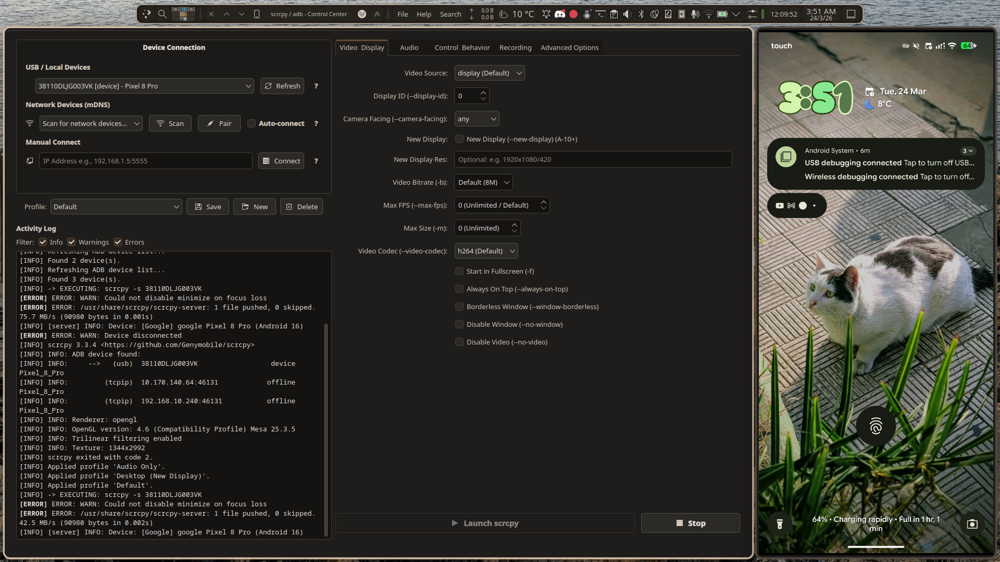

Scrcpy-PyQt6 - ( vibecoded side-project)



What it is
- A tiny, personal GUI wrapper around `scrcpy` and `adb` that saves you from writing or remembering command-line flags. This repo is vibecoded for personal use; it was assembled with GitHub Copilot assistance.

Why
- personal convenience tool — not a legit app. (vibecoded oooOoooOoo)
- Credits: this wrapper uses and depends on the original tools it wraps (scrcpy, adb/platform-tools, avahi/zeroconf, etc.). https://github.com/Genymobile/scrcpy by Genymobile and their contributors, all thanks to them.
- License: MIT (see `LICENSE`)

Install (developer / personal)
- Ensure `adb` (platform-tools), `scrcpy`, and system mDNS (`avahi` / `avahi-browse` or `python-zeroconf`) are installed.
- Run the included installer to copy files to your user-local paths:

```bash
./install_to_system.sh
```

Uninstall
- To remove the installed files run the uninstaller included with this repo:

```bash
./uninstall_from_system.sh
```

The uninstaller removes the files installed by this script.

Dependencies hints
- Debian/Ubuntu: `sudo apt install adb scrcpy avahi-utils python3-pyqt6` (or use `python3-pyside6` if you prefer LGPL)
- Fedora: `sudo dnf install android-tools scrcpy avahi python3-qt6` (package names vary)
- Arch: `sudo pacman -S android-tools scrcpy avahi python-pyqt6`

Development
- Create a virtualenv and install Python deps:

```bash
python -m venv .venv
source .venv/bin/activate
pip install -r requirements.txt
```

Contributions
- This is mainly for personal use; but suggestions, issues, and pull requests are welcome. Keep changes small and simple, not trying to build anything crazy here lol.
